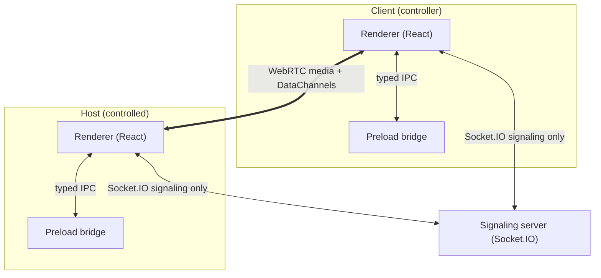

# Lantern Remote

Open-source remote desktop application built with Electron, WebRTC, and Socket.IO.
A portfolio-quality project demonstrating real-time communication, desktop capture,
and secure Electron architecture. Inspired by the _architecture_ of tools like
AnyDesk/TeamViewer — no branding, proprietary UI, or code is copied.

> **Phase 9 status:** opt-in text clipboard sync is live — enable it in
> Settings (off by default), copy on either side while connected and the
> text appears on the peer. Images/rich content never sync (read as empty,
> skipped). File transfer (Phase 11) is not yet implemented.

## Architecture



After signaling, screen video and input flow peer-to-peer over encrypted WebRTC.
The signaling server never receives screen video.

**Why Socket.IO:** `socket.io` (server) and `socket.io-client` (renderer) provide
rooms, acknowledgements, and reconnect for presence and connection-request
routing. They are not used for media. The renderer owns the socket because
Phase 3 `RTCPeerConnection` also lives in the renderer.

## Electron process model

- `electron/main.ts` — app lifecycle, single-instance lock, window creation.
- `electron/main/window.ts` — `BrowserWindow` with `contextIsolation: true`,
  `nodeIntegration: false`, `sandbox: true`.
- `electron/main/ipc.ts` — all `ipcMain.handle` registrations (typed channels).
- `electron/preload.ts` — `contextBridge` exposing only `window.lantern`.
- `electron/services/` — main-process services (`DeviceIdentityService`, `Logger`).
- `shared/ipc.ts` — single source of truth for IPC channels and payloads.
- `shared/signaling.ts` — signaling events, payloads, and validators.
- `src/` — React renderer (components/pages/hooks/stores/services).
- `server/` — Socket.IO signaling (device registry, rooms, consent routing).

## Development

Requirements: Node.js 20+, npm.

```bash
npm install
npm run server   # signaling on http://localhost:3001
npm run start    # Electron app (another terminal)
```

Linux sandbox note: if `npm run start` aborts on `chrome-sandbox` SUID,
use `ELECTRON_DISABLE_SANDBOX=1 npm run start` (dev machines only).

Two local instances (two device IDs) need separate userData directories:

```bash
# terminal A
npm run server

# terminal B (host)
ELECTRON_DISABLE_SANDBOX=1 npm run start

# terminal C (client) — only after the first app's Vite server is up
ELECTRON_DISABLE_SANDBOX=1 LANTERN_USER_DATA=/tmp/lantern-client-b \
  LANTERN_ALLOW_MULTI_INSTANCE=1 npm run start
```

If the second `npm run start` fails because the Vite port is taken, reuse the
first renderer URL by launching another Electron process against the already
running Forge session, still with a distinct `LANTERN_USER_DATA`.

Configuration (see `.env.example`):

```bash
VITE_SIGNALING_SERVER_URL=http://localhost:3001
STUN_SERVERS=stun:stun.l.google.com:19302
```

## Host requirements (remote input)

Remote control needs an OS input backend on the **host** machine (runtime
requirement, not a build dependency — the app runs fine without it and
reports "unavailable" honestly):

| Host OS     | Install                    | Notes                                                                                |
| ----------- | -------------------------- | ------------------------------------------------------------------------------------ |
| Linux (X11) | `sudo apt install xdotool` | Wayland sessions need ydotool instead (planned)                                      |
| macOS       | `brew install cliclick`    | Grant Accessibility permission: System Settings → Privacy & Security → Accessibility |
| Windows     | —                          | No backend yet (see roadmap)                                                         |

## Security model (summary)

See `SECURITY.md`. Key points:

- Renderer has no Node.js access; all privileged operations go through typed IPC.
- Every remote session requires explicit host approval (Accept/Reject).
- Device ID is an identifier, not a password; Phase 8 adds expiring tokens.
- WebRTC media/DataChannels are encrypted; signaling carries no video.
- Device ID is persisted under `app.getPath('userData')`, never a MAC address.

## Known limitations (Phase 9)

- Codes travel opaquely through the signaling server (shape-checked only),
  so a compromised server could harvest a live code — bounded by 10-minute
  expiry + single-use burn. Production needs authenticated registration.
- Text clipboard only (256 KiB cap, rejected not truncated); image or rich
  clipboard content reads as empty and is skipped, so copying an image never
  wipes the peer's text. Only changes made while connected _and_ enabled
  propagate — pre-existing differences do not.
- Linux/X11 host input works via xdotool (mouse + keyboard); macOS via
  cliclick (mouse: move/left/right-click; keyboard: modifiers + listed
  special keys). Wayland needs ydotool (planned); Windows is stubbed.
- Keyboard events arrive in Phase 7; clipboard in Phase 9.
- No ICE retry on `disconnected`; a failed peer tears the session down.
- Temporary connection tokens arrive in Phase 8.
- Single main window; no tray, no multi-monitor selection yet.
- Single main window; no tray, no multi-monitor selection yet.

## Roadmap

Phases 10–12 per spec: settings/logging → tests → polish.
