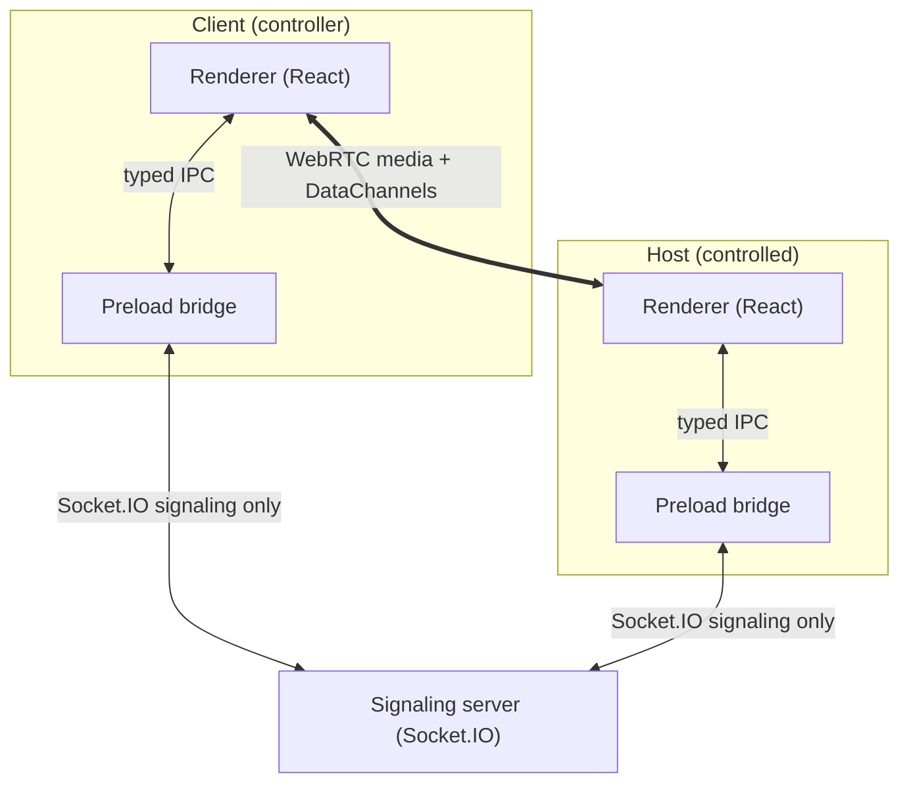

# Lantern Remote

Open-source remote desktop application built with Electron, WebRTC, and Socket.IO.
A portfolio-quality project demonstrating real-time communication, desktop capture,
and secure Electron architecture. Inspired by the _architecture_ of tools like
AnyDesk/TeamViewer — no branding, proprietary UI, or code is copied.

> **Phase 1 status:** Electron Forge + Vite + React + TypeScript scaffold with a
> secure IPC bridge and placeholder UI. Signaling (Phase 2), WebRTC (Phase 3),
> screen capture (Phase 4), and remote input (Phases 6–7) are not yet implemented.

## Architecture



After signaling, screen video and input flow peer-to-peer over encrypted WebRTC.
The signaling server never receives screen video.

## Electron process model

- `electron/main.ts` — app lifecycle, single-instance lock, window creation.
- `electron/main/window.ts` — `BrowserWindow` with `contextIsolation: true`,
  `nodeIntegration: false`, `sandbox: true`.
- `electron/main/ipc.ts` — all `ipcMain.handle` registrations (typed channels).
- `electron/preload.ts` — `contextBridge` exposing only `window.lantern`.
- `electron/services/` — main-process services (`DeviceIdentityService`, `Logger`).
- `shared/ipc.ts` — single source of truth for IPC channels and payloads.
- `src/` — React renderer (components/pages/hooks/stores/services/types/utils).
- `server/` — Socket.IO signaling server (Phase 2).

## Development

Requirements: Node.js 20+, npm.

```bash
npm install
npm run start    # development
npm run package  # production package
npm run make     # distributables
```

Configuration (see `.env.example`):

```bash
VITE_SIGNALING_SERVER_URL=http://localhost:3001
STUN_SERVERS=stun:stun.l.google.com:19302
```

## Security model (summary)

See `SECURITY.md`. Key points:

- Renderer has no Node.js access; all privileged operations go through typed IPC.
- Every remote session requires explicit host approval (Accept/Reject).
- Device ID is an identifier, not a password; Phase 8 adds expiring tokens.
- WebRTC media/DataChannels are encrypted; signaling carries no video.

## Known limitations (Phase 1)

- Device ID is ephemeral (persistence lands in Phase 2).
- Connect button disabled; no signaling/WebRTC/capture/input yet.
- Single main window; no tray, no multi-monitor selection yet.

## Roadmap

Phases 2–12 per spec: signaling → WebRTC → capture → viewer → mouse →
keyboard → auth tokens → clipboard → settings/logging → tests → polish.
