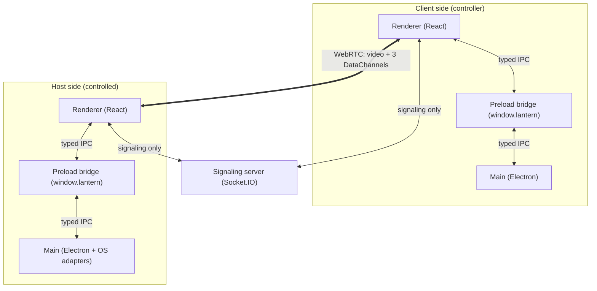
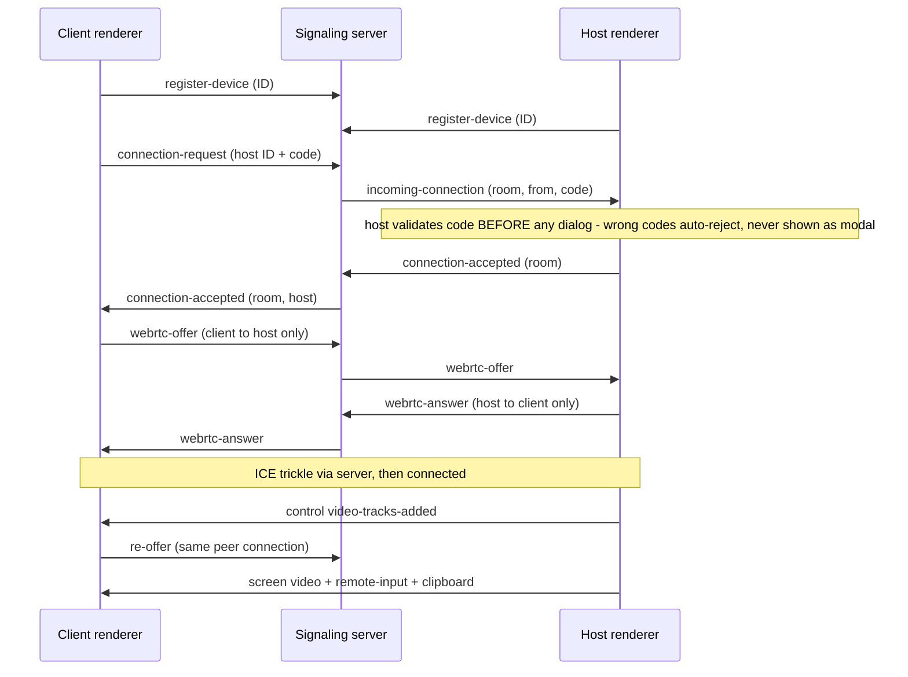

# Lantern Remote

Open-source remote desktop — explicit consent required for every session.
Built with Electron, WebRTC, and Socket.IO. A portfolio-quality project
demonstrating real-time communication, desktop capture, and secure Electron
architecture. Inspired by the _architecture_ of tools like AnyDesk/TeamViewer —
no branding, proprietary UI, or code is copied.

> **Consent first:** there is no auto-accept, no stealth mode, no persistence
> trick. Every session needs device ID + expiring connection code + the host's
> explicit Accept. See `SECURITY.md`.

## Features

- **Host & client in one app** — share this screen, or drive a remote one.
- **Connection codes** — 6-character, single-use, 10-minute expiry, validated
  by the host before any Accept/Reject dialog appears.
- **Remote mouse + keyboard** — normalized coordinates (any window size drives
  any display), focus-keyed capture with held-key flush, whitelisted key codes.
- **Opt-in text clipboard sync** — off by default, both directions, 256 KiB cap.
- **Session diagnostics** — signaling/RTC/ICE states, disconnect reasons.
- **Local history** — last 20 connections in `localStorage`, never on a server.
- **Settings** — signaling URL, STUN servers, clipboard toggle, persisted locally.
- **170 automated tests** — `npm run test:run`.

The automated suite verifies protocol, service, store, and signaling behavior.
The full two-instance Electron flow (live WebRTC pixels, OS clipboard, cursor,
and keyboard injection) still requires manual GUI verification on the target OS.

## Architecture

Three processes cooperate; the signaling server is deliberately dumb:



After signaling, screen video and input flow peer-to-peer over encrypted
WebRTC (DTLS-SRTP media, encrypted SCTP DataChannels). The signaling server
never receives video, input, clipboard text, or connection codes — it routes
shapes, never values.

### Session flow



### WebRTC channels (one peer connection)

| Channel        | Label          | Contents                                                                        |
| -------------- | -------------- | ------------------------------------------------------------------------------- |
| `control`      | `control`      | Session control frames (`video-tracks-added/ended`) — parsed, never executed.   |
| `remote-input` | `remote-input` | Validated mouse/keyboard messages, normalized 0.0–1.0 coords. Throttled moves.  |
| `clipboard`    | `clipboard`    | Text-only frames, 256 KiB cap, opt-in both ends. Empty/oversize frames dropped. |

Direction is enforced server-side (offers client→host, answers host→client);
unknown DataChannel labels are ignored. Every remote frame — signaling or
DataChannel — is validated before use; malformed input is dropped, never logged
beyond its kind.

## Electron process model

- `electron/main.ts` — lifecycle, single-instance lock, service wiring.
- `electron/main/window.ts` — `BrowserWindow` with `contextIsolation: true`,
  `nodeIntegration: false`, `sandbox: true`. Never weakened.
- `electron/main/ipc.ts` — every `ipcMain` handler in one place, typed channels.
- `electron/preload.ts` — `contextBridge` exposing **only** `window.lantern`.
- `electron/services/` — main-process owners of secrets and OS access
  (`DeviceIdentityService`, `ConnectionTokenService`, `RemoteInputService`,
  `ClipboardService`, `DesktopSourcesService`, `Logger`).
- `shared/` — the contracts: `ipc.ts` (channels/payloads), `signaling.ts`
  (events/validators), `remoteInput.ts`, `clipboard.ts`, `connectionToken.ts`,
  `deviceId.ts`, plus `fileTransfer.ts` (**types only** — no implementation yet).
- `src/` — React renderer: presentational components; logic in
  `services/`, `hooks/`, `stores/` (Zustand).
- `server/` — Socket.IO signaling: device registry, rooms, consent routing.

**Rules the codebase enforces:** renderer never touches `ipcRenderer`/Node;
`shared/ipc.ts` is the single source of truth; no `any` without justification;
one service per concern; main-process handlers are safe under concurrent calls
(StrictMode double-fires renderer boot — single-flight promises, unique tmp
files); never log secrets, tokens, clipboard, or raw input.

## Development

Requirements: Node.js 20+, npm.

```bash
npm install
npm run server   # signaling on http://localhost:3001
npm run start    # Electron app (another terminal)
npm run test:run # 170 tests (vitest)
npm run typecheck && npm run lint
npm run package  # production package
npm run make     # distributables
```

Linux sandbox note: if `npm run start` aborts on `chrome-sandbox` SUID,
use `ELECTRON_DISABLE_SANDBOX=1 npm run start` (dev machines only).

Two local instances (host + client need separate profiles — different device IDs):

```bash
# terminal A
npm run server

# terminal B (host)
ELECTRON_DISABLE_SANDBOX=1 npm run start

# terminal C (client) — after the first app's Vite server is up
ELECTRON_DISABLE_SANDBOX=1 LANTERN_USER_DATA=/tmp/lantern-client-b \
  LANTERN_ALLOW_MULTI_INSTANCE=1 npm run start
```

Use throwaway dirs under `/tmp`; never point `LANTERN_USER_DATA` at the real
profile (`~/.config/Lantern Remote`).

Configuration (see `.env.example`): `VITE_SIGNALING_SERVER_URL`,
`VITE_STUN_SERVERS` (comma-separated; TURN entries append the same way),
`SIGNALING_PORT`. The Settings panel can override signaling URL and STUN at
runtime; clipboard sync defaults **off**.

## Host requirements (remote input)

Remote control needs an OS input backend on the **host** (runtime requirement,
not a build dependency — the app runs fine without one and reports
"unavailable" honestly):

| Host OS     | Install                    | Notes                                                                                |
| ----------- | -------------------------- | ------------------------------------------------------------------------------------ |
| Linux (X11) | `sudo apt install xdotool` | Wayland sessions need ydotool instead (planned)                                      |
| macOS       | `brew install cliclick`    | Grant Accessibility permission: System Settings → Privacy & Security → Accessibility |
| Windows     | —                          | No backend yet (see roadmap)                                                         |

## Security model (summary)

See `SECURITY.md`. Key points:

- Renderer has no Node.js access; all privileged operations go through typed IPC.
- Every session = device ID (identifier, not secret) + expiring single-use
  code + explicit host Accept. Wrong codes auto-reject and are counted.
- WebRTC media/DataChannels are encrypted; signaling carries no video, input,
  clipboard, or codes.
- Device ID is random (`crypto.randomInt`), persisted under
  `app.getPath('userData')` — never a MAC address.
- Clipboard sync is off by default, text-only, capped, and never logged.
- Diagnostics count events; they never carry contents.

## Known limitations

- Codes travel opaquely through the signaling server (shape-checked only) —
  a compromised server could harvest a live code, bounded by 10-minute expiry
  - single-use burn. Production needs authenticated registration.
- Text clipboard only; image/rich content reads as empty and is skipped, so
  copying an image never wipes the peer's text. Only changes made while
  connected _and_ enabled propagate.
- Linux/X11 input via xdotool; macOS via cliclick (no wheel/letters — listed
  keys only). Wayland needs ydotool (planned); Windows is stubbed.
- Keyboard capture needs the video focused (click it — the KEYS chip shows);
  browser-reserved chords (Ctrl+W etc.) still act locally.
- No ICE retry on `disconnected`; a failed peer tears the session down.
- No TURN in default config — symmetric NATs may fail; add TURN servers in Settings.
- Single main window; capture has a monitor picker, but remote input does not yet
  account for global desktop offsets on secondary monitors.

## Roadmap

- **File transfer** — `shared/fileTransfer.ts` defines the protocol types
  (chunking, progress, cancellation, integrity) for a future `file-transfer`
  DataChannel. No implementation until core is stable.
- Windows input backend + Wayland (ydotool) support.
- Authenticated device registration + TURN credentials for production.
- ICE retry / reconnect instead of teardown on transient blips.
